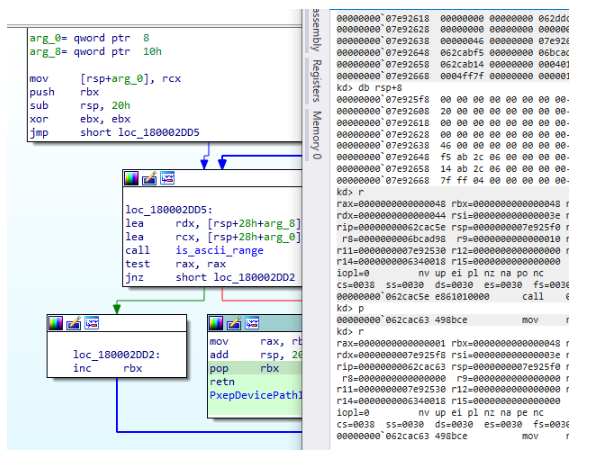

# BlackLotus-analysis-stage2-bootkit-rootkit-stage

BlackLotus stage 2 bootkit-rootkit analysis

Before we dive into this divine shit(belive me this is some divine shit as nobody can do this withouth GOD's Will(at least that's my opinion on this)) ,here's the hash for the bootkit file

<div>


 

<figure><figcaption></figcaption></figure>

</div>

Frist things first this is how a healthy system looks like

<div>


 

<figure><figcaption></figcaption></figure>

</div>

<div>


 

<figure><figcaption></figcaption></figure>

</div>

```
C:\Windows\system32>BCDEdit

Windows Boot Manager
--------------------
identifier              {bootmgr}
device                  partition=\Device\HarddiskVolume9
path                    \EFI\MICROSOFT\BOOT\BOOTMGFW.EFI
description             Windows Boot Manager
locale                  en-US
inherit                 {globalsettings}
default                 {current}
resumeobject            {3f80ecd0-df10-11ed-bafc-80a84b2564bb}
displayorder            {current}
toolsdisplayorder       {memdiag}
timeout                 30

Windows Boot Loader
-------------------
identifier              {current}
device                  partition=C:
path                    \Windows\system32\winload.efi
description             Windows 10
locale                  en-US
inherit                 {bootloadersettings}
recoverysequence        {3f80ecd2-df10-11ed-bafc-80a84b2564bb}
displaymessageoverride  Recovery
recoveryenabled         Yes
isolatedcontext         Yes
allowedinmemorysettings 0x15000075
osdevice                partition=C:
systemroot              \Windows
resumeobject            {3f80ecd0-df10-11ed-bafc-80a84b2564bb}
nx                      OptIn
bootmenupolicy          Standard

```

Now on my analysis i never managed to infect my machine such i will use the example from the already referenced asian's researcher blog post which this is how it's supposed to look an infected one

```
    // Windows Boot Manager
    // --------------------
    // identifier              {9dea862c-5cdd-4e70-acc1-f32b344d4795}
    // description             Windows Boot Manager
    // locale                  en-US
    // inherit                 {7ea2e1ac-2e61-4728-aaa3-896d9d0a9f0e}
    // bootdebug               Yes
    // displayorder            {57e1b615-0355-11ec-abb0-005056c00008}
    // timeout                 30

    // Windows Boot Loader
    // -------------------
    // identifier              {57e1b615-0355-11ec-abb0-005056c00008}
    // device                  boot
    // path                    \system32\hvloader.efi
    // description             Hoy la disco se flota
    // locale                  en-US
    // inherit                 {6efb52bf-1766-41db-a6b3-0ee5eff72bd7}
    // truncatememory          0x10000000
    // avoidlowmemory          0x1000
    // nointegritychecks       Yes
    // testsigning             Yes
    // isolatedcontext         Yes
    // osdevice                boot
    // systemroot              \
    // ems                     Yes
```

\=============================================================================

\=============================================================================

Before we get started how does one setup the environment for the analysis of an efi module anyway ? Well courtesy goes to @MaverickMusic\_\_ , during a disscussion with him he handed me this( `https://zhuanlan-zhihu-com.translate.goog/p/343293521?_x_tr_sl=auto&_x_tr_tl=en&_x_tr_hl=en-GB` ). Now i didn't completly follow the stepts there so here's what exactly i did in order to have the environment up and running :

\-First i installed edk2(https://github.com/tianocore/tianocore.github.io/wiki/Windows-systems)

\-Second i have configured my ovmf as debug not realease(this will help us later). Here is the command `build -a X64 -t VS2019 -b DEBUG -p OvmfPkg/OvmfPkgX64.dsc`

\-Third i had to configure my windbg. How tf did i do this ? I downloaded everything from this link(`git clone https://github.com/microsoft/WinDbg-Samples`). Than i compiled ExdiGdbSrv.sln. Thank i followed everything from this link(https://learn.microsoft.com/en-us/windows-hardware/drivers/debugger/setting-up-qemu-kernel-mode-debugging-using-exdi), from whevere it said `Use regsvr32 to register the DLL in an Administrator command prompt.` till `PS>.\Start-ExdiDebugger.ps1 -ExdiTarget "QEMU" -GdbPort 1234 -Architecture x64 -ExdiDropPath "C:\path\to\built\exdi\files"`. Confusing i know but please wait patiencly as i will defently make a video where i will explain every step! Cool so now that we have a setup environment for debugging how tf do we debug the code ? So we start qemu in my case i did it by executing `qemu-system-x86_64.exe -L . -bios OVMF.fd -hdd dos.img -debugcon file:debug.log -global isa-debugcon.iobase=0x402` . Once i ran qemu commmand i instantly went and selected compat\_monitor0 from view menu of qemu. It should look like that when you do that.&#x20;

<figure><figcaption></figcaption></figure>


also after selecting this you should input gdbserver to start a remeote instance of gdb debuggin to which we will attach with windbg using this command `.\Start-ExdiDebugger.ps1 -ExdiTarget "QEMU" -GdbPort 1234 -Architecture x64` Cool so once we connect to it will look like this

<div>


 

<figure><figcaption></figcaption></figure>

</div>

```
So how do we set up a breakpoint in order to debug the bootkit? Well that's we we compiled the ovmf image as debug rather than release. If you specifically start qemu with that command you'll have qemu run and debug messages will be logged in a file called debug.log , which looks like this 
```

<div>


 

<figure><figcaption></figcaption></figure>

</div>

So cool now to make sense of this output, for our case the only relevant line is `EntryPoint=0x000062C9A8C` which is like the preffered loaded address whenever we run the bootkit. Specifically for the bootkit it varies between `0x62C4A8C or 0x62C9A8C`. Now we can rebase the program in ida and do our normal work :) . Enojoy the rest of the blog!

\=============================================================================

Bindiffing the original winload.efi with the one dropped by the blacklotus

<div>


 

<figure><figcaption></figcaption></figure>

</div>

<div>


 

<figure><figcaption></figcaption></figure>

</div>

<div>


 

<figure><figcaption></figcaption></figure>

</div>

<div>


 

<figure><figcaption></figcaption></figure>

</div>

We see some similarities but also some discepancies, but nothing usefull,anywayy....

\=============================================================================

Cool so let's get this party started.

<div>


 

<figure><figcaption></figcaption></figure>

</div>

<div>


 

<figure><figcaption></figcaption></figure>

</div>

Cool so let's start dissecating. So first we see that we have a function which gets called. Cool so what about it ? well

<div>


 

<figure><figcaption></figcaption></figure>

</div>

<div>


 

<figure><figcaption></figcaption></figure>

</div>

Cool another function . Not quite... Notice something familiary ?

<div>


 

<figure><figcaption></figcaption></figure>

</div>

<div>


 

<figure><figcaption></figcaption></figure>

</div>

<div>


 

<figure><figcaption></figcaption></figure>

</div>


<div>


 

<figure><figcaption></figcaption></figure>

</div>

Nothing yet???

No problemo maybe now

<div>


 

<figure><figcaption></figcaption></figure>

</div>

<div>


 

<figure><figcaption></figcaption></figure>

</div>

Same demangle function! Hi there old friend :)))

Cool but what about `return (*(a1 + 88))(v2, &unk_62CEABC, 3i64);` ?? Well honestly idk what to say just soley from a static perspective so let's try to use the debugger to understand it :))

So when we demangle the string we get

<div>


 

<figure><figcaption></figcaption></figure>

</div>

So next when we end up to the call instruction

<div>


 

<figure><figcaption></figcaption></figure>

</div>

and we get no info.... great, but why is that ? bc we don't have a .pdb file so we can get debug symbols.... Cool at least ida is helpfull here. So we know that the "grand" function takes as input SystemTable->RuntimeServices, which is of type EFI\_SYSTEM\_TABLE. Cool if we inspect it this is a `A pointer to the EFI Runtime Services Table.` . if we search around googler we come around a bunch of docs but one crucial doc we come around is https://uefi.org/sites/default/files/resources/UEFI\_Spec\_2\_1\_D.pdf . there is says

<div>


 

<figure><figcaption></figcaption></figure>

</div>

Cool so a struct with bunch of pointers, ye, but let's zoom in more.

So first it demangles VbsPolicyDisable, if we search google we come around eset analysis which states `that this variable is evaluated by the Windows OS loader during boot and if defined, the core VBS features, such as HVCI and Credential Guard will not be initialized.` , so basically this variable is responsible for current "security" at boot level. Cool next we have the function which takes that variable and

<div>


 

<figure><figcaption></figcaption></figure>

</div>

and so we can come to the conclusion that this must be a function which changes somehow the state of that variable. Cool so what are some possible function that could do this ? there's only one such function in EFI\_SYSTEM\_TABLE which EFI\_SET\_VARIABLE SetVariable;

So we conclude that this function simply take VbsPolicyDisable and sets it to

```
db  77h ; w
.data:0000000180005034                 db  59h ; Y
.data:0000000180005035                 db    3
.data:0000000180005036                 db  32h ; 2
.data:0000000180005037                 db  4Dh ; M
.data:0000000180005038                 db 0BDh ; ½
.data:0000000180005039                 db  60h ; `
.data:000000018000503A                 db  28h ; (
.data:000000018000503B                 db 0F4h ; ô
.data:000000018000503C                 db 0E7h ; ç
.data:000000018000503D                 db  8Fh
.data:000000018000503E                 db  78h ; x
.data:000000018000503F                 db  4Bh ; K.
```

Now is there anything important about these bytes ? well yes, if you by chance have read the first part of the blacklotus analysis you'll know that i referenced an asian's researcher work. Well that researcher was kind enough to also analyse the dropped bootkit . Please check it out(https://www.cnblogs.com/DirWang/p/17294545.html#autoid-3-2-1) , so in his analysis he was kind enough to give us that info. He points us to https://github.com/Mattiwatti/EfiGuard/blob/master/EfiGuardDxe/PatchWinload.c . there we see a similar line

<div>


 

<figure><figcaption></figcaption></figure>

</div>

Is there a specific reason behind this , honestly i don't know it's my first time analysing a bootkit . Please do let me know or make a pr/pull request to edit this document if you have more experience than i do :) in this area

\=============================================================================

Cool next, fortune favours us and the pseudo code from ida is simillar with assebmly

<div>


 

<figure><figcaption></figcaption></figure>

</div>

so what i guess happens here is normal initialisation of EFI\_SYSTEM\_TABLE which basically i guess initializes which process to continue the boot process. and than we have the function call PatchBootManager

\=============================================================================

PatchBootManager

<div>


 

<figure><figcaption></figcaption></figure>

</div>

<div>


 

<figure><figcaption></figcaption></figure>

</div>

<div>


 

<figure><figcaption></figcaption></figure>

</div>

And from pseudo code

<div>


 

<figure><figcaption></figcaption></figure>

</div>

<div>


 

<figure><figcaption></figcaption></figure>

</div>

Coll so first function call we see it does is HandleProtocol. So what the code does it do ? Luckly we stumble upong this when doing a quick google search (https://tianocore-docs.github.io/edk2-ModuleWriteGuide/draft/5\_uefi\_drivers/54\_communication\_between\_uefi\_drivers.html) and we see that it `retrieve protocols`. Cool nothign rlly that can i make sense. Ye i gotcha' fam. So basically this retrives communication informationmethods used by other UEFI drivers. Cool some more digging. we see the second parameter is

<div>


 

<figure><figcaption></figcaption></figure>

</div>

If we search for that specifc bytes we come across this

<div>


 

<figure><figcaption></figcaption></figure>

</div>

so wtf does EFI\_LOADED\_IMAGE\_PROTOCOL\_GUID do ? quoting from(https://uefi.org/specs/UEFI/2.10/09\_Protocols\_EFI\_Loaded\_Image.html) `Can be used on any image handle to obtain information about the loaded image.` , what type of info ? \`\`\`This section defines EFI\_LOADED\_IMAGE\_PROTOCOL and the EFI\_LOADED\_IMAGE\_DEVICE\_PATH\_PROTOCOL. Respectively, these protocols describe an Image that has been loaded into memory and specifies the device path used when a PE/COFF image was loaded through the EFI Boot Service LoadImage(). These descriptions include the source from which the image was loaded, the current location of the image in memory, the type of memory allocated for the image, and the parameters passed to the image when it was invoked.\`\`\`\`

So in our case grabs info about the bootkit. Now there's a problem we can't rlly inspect the resut of the function bc we have no debug symbols :/ but we can presume. and i tend to presume that the structure(result from previous function call)will be in rbx.

<figure><figcaption></figcaption></figure>

Next we call demangle string

<figure><figcaption></figcaption></figure>

which gets us

<div>


 

<figure><figcaption></figcaption></figure>

</div>

and than we call

<div>


 

<figure><figcaption></figcaption></figure>

</div>

\=============================================================================

sub\_180002B14

<div>


 

<figure><figcaption></figcaption></figure>

</div>

<div>


 

<figure><figcaption></figcaption></figure>

</div>

<div>


 

<figure><figcaption></figcaption></figure>

</div>

and pseudo code

<div>


 

<figure><figcaption></figcaption></figure>

</div>

Cool so until the if everythin's self explanatory,now what about the if? We see again it does a call with unk\_180005010 as parameters which is an array of bytes again, upon further inspection it looks like this

<figure><figcaption></figcaption></figure>

Now if we inspect the first bytes again and do a quick search we come around this (https://github.com/theopolis/uefi-firmware-parser/blob/master/uefi\_firmware/guids/efiguids\_ami.py) more precisely this `'EFI_DEVICE_PATH_PROTOCOL_GUID': [0x09576e91, 0x6d3f, 0x11d2, 0x8e, 0x39, 0x00, 0xa0, 0xc9, 0x69, 0x72, 0x3b]` .

If we go again on uefi's spec page we see that `Can be used on any device handle to obtain generic path/location information concerning the physical device or logical device.`. Coon we also se more like this `The device path describes the location of the device the handle is for`. OK cool and if we scroll just a little we see a function called \_EFI\_DEVICE\_PATH\_PROTOCOL. Ok so to conclude we know this this has ti di with EFI\_DEVICE\_PATH\_PROTOCOL\_GUID but our function is of type EFI\_BOOT\_SERVICES. So is there any function in EFI\_BOOT\_SERVICES which could do something like handling a protocol ? yes there is . If we inspect https://www.intel.com/content/dam/doc/product-specification/efi-v1-10-specification.pdf section 4.4 we see

<div>


 

<figure><figcaption></figcaption></figure>

</div>

more precisely it has a function to which we are familiar(HandleProtocol). Cool

Next we see another function call unkow this time to us. Let's see what arguments it takes, So it take 2,than len of passed string as unicode , and ptr to a variable

<div>


 

<figure><figcaption></figcaption></figure>

</div>

Now if we inspect this in a debugger

<div>


 

<figure><figcaption></figcaption></figure>

</div>

we see a weird thing rcx has a debug string which AllocatePool, which comes after a function call so we conclude that this was possible a call to AllocatePool, funny enough if you also inspect the specs you'll see that boot\_services also has a ptr to AllocatePool which only makes our assumption stronger.

Cool so if we manage to allocate enough space(the check if >= 0 is to check if we succesed to allocate bc if EFI\_OUT\_OF\_RESOURCES is implemented as

<div>


 

<figure><figcaption></figcaption></figure>

</div>

it's only safe to assume

<div>


 

<figure><figcaption></figcaption></figure>

</div>

is used for success allocation)

One interesting fact is that the buffer after allocating it is not zero but rather it has these bytes in it. If anyone knows more abut this please make a pr request to edit this document

<div>


 

<figure><figcaption></figcaption></figure>

</div>

So yeah anyway we end up calling memcpy after the call our buffer looks like this

<div>


 

<figure><figcaption></figcaption></figure>

</div>

We than append some bytes to get the buffer to look like this

<div>


 

<figure><figcaption></figcaption></figure>

</div>

And than call a function called FileDevicePath\_call which looks about like this&#x20;

<figure><figcaption></figcaption></figure>

<figure><figcaption></figcaption></figure>

And translates to this

<div>


 

<figure><figcaption></figcaption></figure>

</div>

Cool but this don make no sense if not explained so....

first we have a custom implementation of strlen which we won't dissecc cause it's usless :) But here's the result

<div>


 

<figure><figcaption></figcaption></figure>

</div>

<div>


 

<figure><figcaption></figcaption></figure>

</div>

32 chars from len(of(str)+"\x00" and than the last 4 bytes appended before the function call 0x4FF7F

Next we call what i also used from the asian's research blog post PxepDevicePathInstanceCount, which is simply strlen, cause it simply counts each letter and has a counter. as seen here

<div>


 

<figure><figcaption></figcaption></figure>

</div>

So yeah we see pop rbx and after call we see rbx=0x48

<div>


 

<figure><figcaption></figcaption></figure>

</div>

we than call against strlen again on the same string , i guess this is just bc on next line precisly , `v6 + v4 * v5;` we do v4\*v5 which is like i guess some way of having unicode strings i guess

Anyway an than we allocate memory again using gEfiBootServices + 64 which we previously enocuntered which solved to AllocatePool.

So here we also see something nice which is

<div>


 

<figure><figcaption></figcaption></figure>

</div>

the fact that here the memory block has the pattern afafafaf in it .

So what happens next is that we get two buffer which look like this after the main loop executes

<div>


 

<figure><figcaption></figcaption></figure>

</div>

<div>


 

<figure><figcaption></figcaption></figure>

</div>

And truelly speaking we are interested in only the first one because that's what get's returned, so we can conclude this simply i guess copies the device path and clear some garbabe from buffer. :))

Now after we finish with this we check to see if the device path in our case is already i guess initialised and free the pool if not we return the clearer buffer from the previous mentioned function .

Before we finish with this function i would like to point another interesting fact , this is how it looks in memory the bootservice table :) it looks like according to the specs with the begging header just figured it might be interesting to let here for anyone who wanna do feature work and find themselves finding this string BOOTSERVF in a dump, this is deffno bootservice table

\=============================================================================

Right so what happens next ??? well we check to see if we managed to locate the winload.efi file and we load it into memory. this is the pseudo code :)

<div>


 

<figure><figcaption></figcaption></figure>

</div>

And this is how it looks into memory

<div>


 

<figure><figcaption></figcaption></figure>

</div>

what is rax? rax is a handle to the image :) don't be dumb like me when i first tought that it is a memory zone :)

Cool before we head in for some more let me quickly explain wtf is winload.efi. So, `with the development of computers, the traditional BIOS boot is outdated, and the security confrontation about UEFI boot has started. From the flow chart below, we can see that MBR and VBR no longer exist in UEFI, but UEFI itself is responsible for loading bootmgr, which also means safer and faster`

<div>


 

<figure><figcaption></figcaption></figure>

</div>

So how does a normal windows pc boots ? After BDS, the UEFI firmware code stored in SPI has completed the work, then the UEFI firmware boot manager first queries the NVRAM UEFI variable to find the ESP, and finds the OS-specific boot manager bootmgfw.efi to call its entry function (DXE driver).

This function will first call the EfiInitCreateInputParametersEx function, which is mainly used to convert the EfiEntry parameter into the parameter format expected by bootmgfw.efi.

The Windows Boot Manager entry point BmMain function is then called.

In this function, BmFwInitializeBootDirectoryPath is called to initialize the startup application (BootDirectory) path (\EFI\Microsoft\Boot).

Then BootMgr will read the system boot configuration letter (BCD), if there are multiple boot options, it will call BmDisplayGetBootMenuStatus to display the boot menu.

Then it will call the BmpLaunchBootEntry function to start the application (winload.efi).

Of course, bootmgfw.efi does more than that, as well as boot policy verification code integrity and initialization of secure boot components, so I won’t go into details.

In the final stage of Windows Boot Manager (BootMgr), the BmpLaunchBootEntry function will select the correct boot entry according to the previous BCD value. If full volume encryption (BitLocker) is enabled, the system partition will be decrypted first, and then the control can be transferred to winload.efi.

Next, the BmTransferExecution function is called, the startup options are checked and the execution flow is passed to the BlImgStartBootApplication function.

Then the BlImgStartBootApplication function will call the ImgFwStartBootApplication function, and finally call the ImgArchStartBootApplication function. In it, the memory protection mode of winload.efi will be initialized, Then call the BlpArchTransferTo64BitApplication function, BlpArchTransferTo64BitApplication calls The Archpx64TransferTo64BitApplicationAsm function finally hands over control to winload.efi.

This function will enable the new GDT and IDT, and then completely hand over the control to winload.efi. At this point, BootMgr completes its mission and Winload starts to work. -End of quotes stolen from a chinese website which talks about this(please review this for more content https://bbs.kanxue.com/thread-268267.htm )

And from there winload.efi does it job which is to load windows and do some more hw work before it hands control to kernel .

Now after this sort briefing as we were saying

<div>


 

<figure><figcaption></figcaption></figure>

</div>

we further check to see if loading it into memory successeded and than we do a function called ati\_analysis\_rdtsc\_aia\_cu\_4e1f to which you should be familiar if you have already read the first part of this analysis.

Now for the fun lets pretend we fail to analyse that function and we get detected.Let's see how sub\_180002A08 looks like.

<div>


 

<figure><figcaption></figcaption></figure>

</div>

<div>


 

<figure><figcaption></figcaption></figure>

</div>

we see again gEfiSystemTable + 64 which we actually don't know this time because it's of different type it's not of type bootservices this time is of type efisystemtable than memcpy and another 3 function call which we don't know now if we run until the loop begins

<div>


 

<figure><figcaption></figcaption></figure>

</div>

and if we inspect previous paramets to memcpy

<div>


 

<figure><figcaption></figcaption></figure>

</div>

and we inspect the output image of qemu we get

<div>


 

<figure><figcaption></figcaption></figure>

</div>

Cool so let's make some sense of this ,i'll refear again to the asian's research blogpost cause honestly i'm lost here

So on his blog he says that the two functions were actually

```
ConOut->ClearScreen(ConOut);
ConOut->OutputString(ConOut, String);
```

Ok but wtf is conOut? well also he says that conout is of type EFI\_SIMPLE\_TEXT\_OUTPUT\_PROTOCOL and that conout is obtained by `ConOut = gEfiSystemTable->ConOut;` . ok so what in the code does this mean ??

Ok so let's digg in

the deffinition

<div>


 

<figure><figcaption></figcaption></figure>

</div>

and the guid

<div>


 

<figure><figcaption></figcaption></figure>

</div>

Now my smart ass forgot to actually capture this in a debugger because first when i anaylsed this i confused the data type between efisystemtable and bootservices and i tought this is actually allocatepool.

Now what thoese function do?

Well ClearScreen should be pretty self explanatory and so should OutputString too. How could the researcher come to the conclusion that that variable is of type EFI\_SIMPLE\_TEXT\_OUTPUT\_PROTOCOL? well probably he saw the guid bytes in the debugger.

Now what about the last function ?

well in his blogpost he says that last function is gEfiBootServices->Stall ? so wtf this this do ? . From uefi specs `The Stall() function stalls execution on the processor for at least the requested number of microseconds. Execution of the processor is not yielded for the duration of the stall.`

So basically is makes our cpu freze. cool for how long 0x1C9C380 seconds. a shit tone of time if you ask me. which is again pun in an infite loop so yeah we fucked :)))

And this is how it looks in a debugger

<div>


 

<figure><figcaption></figcaption></figure>

</div>

Now continuing with our main function

<div>


 

<figure><figcaption></figcaption></figure>

</div>

if we manage to load the bootmgfrw.efi(bc winload.efi here is the actual windows bootloader) we call sub\_180002538

\============================================================================= sub\_180002538

From a graph perspective

<div>


 

<figure><figcaption></figcaption></figure>

</div>

From asm perspective

<div>


 

<figure><figcaption></figcaption></figure>

</div>

<div>


 

<figure><figcaption></figcaption></figure>

</div>

<div>


 

<figure><figcaption></figcaption></figure>

</div>

<div>


 

<figure><figcaption></figcaption></figure>

</div>

<div>


 

<figure><figcaption></figcaption></figure>

</div>

Anything ringing a bell yet ? nah well give it a minute it will sinc it , in the meantime take a lookt at pseudo code pov

<div>


 

<figure><figcaption></figcaption></figure>

</div>

<div>


 

<figure><figcaption></figcaption></figure>

</div>

we see some parsing of an exe :) now idk how much it will be the same as the one from previous part(part1) but let's see :)

so we compare our in memory version of the binary(bootmgfrw.efi) with classical mz header(0x5A4D), as you can see

<div>


 

<figure><figcaption></figcaption></figure>

</div>

<div>


 

<figure><figcaption></figcaption></figure>

</div>

ok next we do another classic check which is if we can find pe header

<div>


 

<figure><figcaption></figcaption></figure>

</div>

Cool next we call sub\_1800024C4() which looks like this

<div>


 

<figure><figcaption></figcaption></figure>

</div>

<div>


 

<figure><figcaption></figcaption></figure>

</div>

Cool so what happens here is that we locate certain values in memory and if we found them we return them. Please reffer to sub\_180002538.py.py for the emulation.

Anyhow here's sub\_180002464

<div>


 

<figure><figcaption></figcaption></figure>

</div>

If we successfully execute sub\_1800024C4 we return in the bigger function and follow a few more checks , cool beans let's mase some sense of these

<div>


 

<figure><figcaption></figcaption></figure>

</div>

Cool so we further compare whatever is at rax+0xe with 0x64 hmm cool interesting , inspecting rax+0xe

<div>


 

<figure><figcaption></figcaption></figure>

</div>

Any special reason behind this specific check? honestly idk? it might be if you know please make a pull request and edit this document

we do some more addition and than a comparison

<div>


 

<figure><figcaption></figcaption></figure>

</div>

I wanna stop here for a minute and reference again the previous source of inspiration for this article whenever i got lost, so in his blog he renamed the function which compared values to RtlpImageDirectoryEntryToDataEx, which if we search we got no results but there's something close enough to his names and that is RtlImageDirectoryEntryToData , which basically does this `Given the base address of a kernel module and the index of an entry in the data directory, RtlImageDirectoryEntryToData() returns the virtual address and the size of the directory entry`(https://codemachine.com/articles/top\_ten\_kernel\_apis.html) in our case since we are in an efi/uefi app we can consider that the 50 we see is the size of bytes/mb idk here of our root partition in this case and that that address which is in rax is an entry in our directory.

Before we further proceed there's one more interesting detail to be explained. In his research he converts the output of RtlImageDirectoryEntryToData to this structure

```
 typedef struct _IMAGE_RESOURCE_DIRECTORY_ENTRY {
               union {
                   struct {
                       DWORD NameOffset : 31;
                       DWORD NameIsString : 1;
                   };
                   DWORD   Name;
                   WORD    Id;
               };
               union {
                   DWORD   OffsetToData;
                   struct {
                       DWORD   OffsetToDirectory : 31;
                       DWORD   DataIsDirectory : 1;
                   };
               };
           } IMAGE_RESOURCE_DIRECTORY_ENTRY, *PIMAGE_RESOURCE_DIRECTORY_ENTRY;
```

Now wtf about this structure ?

well doing a quick search about that structure gets us here(http://www.brokenthorn.com/Resources/OSDevPE.html) which tells us that `Parsing resources is a bit more complex then the other directory types, however. Like the other sections, there is a base IMAGE_RESOURCE_DIRECTORY structure that can be obtained from the DataDirectory member of the optional header: blah blah` and also that \`\`\`This structure doesnt have much of any interesting fields, except the last three.

If you have worked with Win32 resources, you might know that resources can be idenitified by ID or name. Two of the members in this structure will let us know the number of these entries, and the total amount of entries (NumberOfNamedEntries + NumberOfIdEntries), which is useful in looping through all of the entries. As you can probably guess, the entries are in the DirectoryEntries array. DirectoryEntries consists of an array of IMAGE\_RESOURCE\_DIRECTORY\_ENTRY structures, which follow the format:\`\`\`

so basically this shit is used internally for parsing stuff internally and for us makes sense in the context of the fact that we work with a directory which has resources in it, cool.

More please!

So up next

<div>


 

<figure><figcaption></figcaption></figure>

</div>

what dis to is that basically iterate over every resource from directory and checks to see if it's of type string

ngl i don't know why he would so if i'm wrong sorry if i'm not cheers!

next

<div>


 

<figure><figcaption></figcaption></figure>

</div>

so what happens here is that we add some offsets and end up to what the chinese researcher says it's second resource table, as you can see

<div>


 

<figure><figcaption></figcaption></figure>

</div>

and than we repeat same process to get some offsets

<div>


 

<figure><figcaption></figcaption></figure>

</div>

and repeat same process this time we check for type VS\_VERSION\_INFO

<div>


 

<figure><figcaption></figcaption></figure>

</div>

so wtf is VS\_VERSION\_INFO? well microsoft(https://learn.microsoft.com/en-us/windows/win32/menurc/versioninfo-resource) says that `Defines a version-information resource`, eg i belive is simply says the version of bootmgfrw.ef

and finally if we found VS\_VERSION\_INFO we repeat same algorithm

<div>


 

<figure><figcaption></figcaption></figure>

</div>

this time with a twist, the twist being that we return the build id :) as we can see

So as a conclusion wtf happened here actually ? well based on the name the chinese researcher used(GetPeFileVersionInfo\_BuildNumber\_) we can conclude that we actauly get build number for bootload as can be seen from the first image

<div>


 

<figure><figcaption></figcaption></figure>

</div>

where here we see the loade bootload in memory

in second image we see

<div>


 

<figure><figcaption></figcaption></figure>

</div>

an integer in rcx which could either be build nr or pefileversion

and 3rd image

<div>


 

<figure><figcaption></figcaption></figure>

</div>

what we could speculate to be build number as ebx will be moved into rax :)

So as a last note on this function, wow amazing engineering

\=============================================================================

Now onto next challenge :) based on the output from previous stage we either set v10 to sub\_180001D80 or sub\_180001D48, as seen

<div>


 

<figure><figcaption></figcaption></figure>

</div>

and in our case v10=sub\_180001D80

<div>


 

<figure><figcaption></figcaption></figure>

</div>

\=============================================================================

We than do a strcmp between our bootloade manager and that array of bytes

<div>


 

<figure><figcaption></figcaption></figure>

</div>

I wanna stop here for a brief short period of time , as you might have guest it i saw something interesting in the chineses researcher blog post. he called the array of btyes SigImgArchStartBootApplication. so wtf is SigImgArchStartBootApplication and to who it belong and why the hack is that array called that way(migos) . So if we search on google(gulugulu) for SigImgArchStartBootApplication we get nothing. Now give that the current context we use the bootloader manager of windows let's open it in IDA. We go to C:\Windows\Boot\EFI, open the binary in ida an search SigImgArchStartBootApplication, nothing. We search for ImgArchStartBootApplication and we are met with

<div>


 

<figure><figcaption></figcaption></figure>

</div>

So ImgArchStartBootApplication .... what the dog doin... !? Well amm...hh I will steal this from `@_xeroxz`(go follow him, wtf you doing if you not following his work....) so basically in an article he says that `bootmgfw.ImgArchStartBootApplication between windows versions 2004-1709 is invoked to start winload.efi` as we can see also from his image(https://guidedhacking.com/threads/hyper-v-hacking-framework-works-on-every-version-of-windows-10-2004-1511-amd-intel.16251/)

<div>


 

<figure><figcaption></figcaption></figure>

</div>

If that was not clear enougn on an article() we see that `ImgArchStartBootApplication to catch the moment when the Windows OS loader (winload.efi) is loaded in the memory but still has not been executed`(https://rustrepo.com/repo/rusty-bootkit--uefi-bootkit-in-rust)

Cool so wtf does strcmp have to do with ImgArchStartBootApplication? well let's take a closer look at ida and we will soon be reveal with the answear, if we search in bootloader code for bytes 41 b8 09 we are soon meet with the coolprit

<div>


 

<figure><figcaption></figcaption></figure>

</div>

And in case we match our in memory image bytes of bootloade with the signature of bytes we execute sub\_180002398

And surely as can be seen we located the pattern we got returned in eax the memory zone where the bytes are and we safely proceed to run sub\_180002398

\=============================================================================

sub\_180002398

"Assembly perspective"

<div>


 

<figure><figcaption></figcaption></figure>

</div>

<figure><figcaption></figcaption></figure>

<figure><figcaption></figcaption></figure>

"Pseudo-code perspective"

<div>


 

<figure><figcaption></figcaption></figure>

</div>

<figure><figcaption></figcaption></figure>

So what the dog doing ? honestly it does some calculation and some additions substractions and nothing rlly important ? why because it's not that interesting . What we interested in is what happens after we return from the function. We see rax

<div>


 

<figure><figcaption></figcaption></figure>

</div>

ok cool so i still don't get it . Well rax = 0x5eec108 which points to 0x48c48b48 , ok and what ? well i was as confused as you were so i returned once again to the chinese blog. So what that researcher describes it happens here is this: it goes back to the beginning of the ImgArchStartBootApplication function. But how tf did he come up with this ? well as mention earlier rax =\
0x48c48b48 and if we inspect the booloadermnfr.efi we see

<div>


 

<figure><figcaption></figcaption></figure>

</div>

which is exactly the same sequence of bytes in 0x5eec108. ok now that's cool :)

Please reffer to sub\_180002398.py to see my failed attempt to emulate this behaviour :)

\=============================================================================

Cool next ?

<div>


 

<figure><figcaption></figcaption></figure>

</div>

<div>


 

<figure><figcaption></figcaption></figure>

</div>

So what happens next is RaiseTPL . ok so what this do ? Raises the priority of the currently executing task and returns its previous priority level. In our case it will be run as highest execution privillages.

Next we call what i called patch\_something which looks like this

<div>


 

<figure><figcaption></figcaption></figure>

</div>

<div>


 

<figure><figcaption></figcaption></figure>

</div>

<div>


 

<figure><figcaption></figcaption></figure>

</div>

So from statical analysis we can see this is what it's known as hooking. :) so basically it patches the bytes of ImgArchStartBootApplication to point to sub\_180001D80 and saves original function of ImgArchStartBootApplication to byte\_180015C78

as as we can see it change to exactly sub\_180001D80

<div>


 

<figure><figcaption></figcaption></figure>

</div>

next we reset the privilleges and from there we hand the control to boomgrfw.efi :)

So this officially marks the first half of the analysis done :) next part we will learn how to further debug sub\_180001D80 and boomgrfw.efi(in our case winload.efi) So please sit thight till i learn how to prepare the environment for the second part of the analysis

\=============================================================================

Now for the second half of the analysis.... How to do we debug boomgrfw.efi ?
